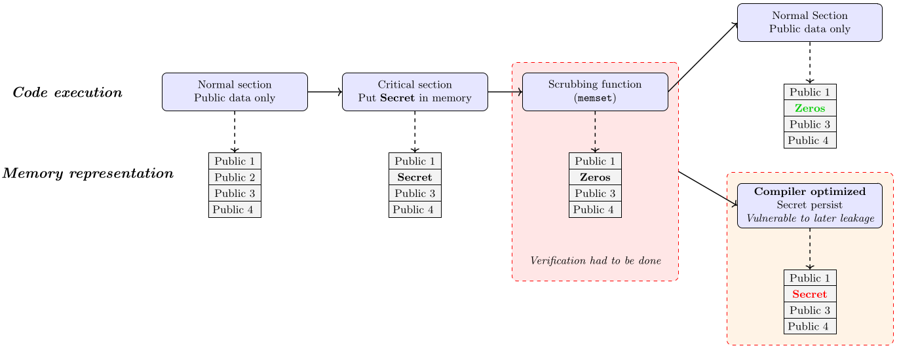

<!-- Load of elements for compiling -->
import { Sample } from "@site/src/components/Binsec/Sample";
import { Editor } from "@site/src/components/DBA/Editor";
import { image, snapshot } from "@site/src/components/Samples/SecretErasure"
import Snippet1 from "@site/src/components/Samples/SecretErasure/Snippet1"

import Icon from "@site/src/components/Icon";
import useBaseUrl from '@docusaurus/useBaseUrl';

# Secret Erasure


In this chapter, we will exercise the **REL**ational **S**ymbolic **E**xecution engine of **BINSEC** to check that no secret data remains in memory after returning from a given function, also known as the **secret-erasure** property.

Indeed, a critical section should not keep the secret data in memory longer than necessary to prevent an attacker from exploiting a memory disclosure vulnerability and accessing the stored secret. Such code can thus use a so-called *scrubbing function* to fill the secret storage with public data (e.g. all zeros).
Unfortunately, the compiler may consider such writes as dead assignments and optimize them out, leaving the executable code unprotected.

<center>
  
</center>

The relational analysis plugin `checkct` proposes a **secret-erasure** check inspired by the [Daniel et al. paper](https://binsec.github.io/assets/publications/papers/2022-tops.pdf) to ensure that memory does not contain any secret past a given point (*a function return in this tutorial*).

## Setup

We will work with a binary challenge from our benchmark repository.

Novelty for this tutorial, we will use a **core dump**. This file loads computer states and helps to deal with dynamically loaded libraries. We will use this file to **ease the configuration** of the initial state of the symbolic execution.

<details>
  <summary>*For console users.*</summary>
```bash
wget https://github.com/binsec/rel_bench/raw/15ed83089660519858865d5a37b45b3a0e5f2195/properties_vs_compilers/secret-erasure/bin/secret-erasure_MEMORY_BARRIER_MFENCE_O3_gcc_8.3.0
chmod +x secret-erasure_MEMORY_BARRIER_MFENCE_O3_gcc_8.3.0
make_coredump.sh secret-erasure.snapshot secret-erasure_MEMORY_BARRIER_MFENCE_O3_gcc_8.3.0
```

Or symply get the files by hand :
 - `binary` : <a href={useBaseUrl('/bin/secret-erasure_MEMORY_BARRIER_MFENCE_O3_gcc_8.3.0')} download><Icon icon="fa-solid fa-file-arrow-down" /></a>
 - `core dump` : <a href={useBaseUrl('/snippet/secret-erasure.snapshot')} download><Icon icon="fa-solid fa-file-arrow-down" /></a>

</details>

:::tip
This simplification requires to use the keyword : `starting from core`.
:::

## Working without a test harness

In the previous [tutorial](./p1_constant-time.md), we used global variables to define what were the secret and public data at the C level.
Here, it is not possible because we already have a compiled binary code. Yet, it is not a big issue for two reasons:
- **BINSEC** supports symbolic variable creation at any arbitrary place (e.g. *loc* `:=` *[* `nondet` *|* `secret` *]*);
- Our binary uses `libsym` functions (like `high_input_32`) to introduce new secret or public data -- we only need to stub them.

:::note
We note that knowledge over the source code can significantly simplify the setup of the analysis.
:::

We can know setup our configuration file.

## Run the analysis

:::warning
The **BINSEC** version hosted for web usage is not compatible with `core dump` usage and will require you to use the console version.
:::


<Sample
    Model={Editor}
    height="15em"
    width='100%'
    value={
`# TO COMPLETE - start

replace <high_input_32> (ptr) by
  @[ptr, 32] := # TO COMPLETE
    as high_input_32
  return
end

replace <low_input_32> (ptr) by
  @[ptr, 32] := # TO COMPLETE
    as low_input_32
  return
end

replace opcode 0f ae f0 by 
end

check secret erasure over <main>

# TO COMPLETE - exploration`}
    filename='secret-erasure_MEMORY_BARRIER_MFENCE_O3_gcc_8.3.0'
    binary={image}
    maxDepth={10000}
    checkct
 />

:::info
While it tries to be as complete as possible, **BINSEC** may miss the semantic definition of an instruction.

We can deal with it by replacing the opcode by a stub in the script, similarly to what we do for addresses or functions; as done by `replace opcode 0f ae f0 by end` (here just ignoring the opcode).
:::
:::note
If this issue arises, feel free to open an issue in the [GitHub repository](https://github.com/binsec/binsec/issues). Our team loves to extend the instruction set.
:::

### Expected result

<details>
<summary>Proposed solution</summary>

<Sample
    Model={Snippet1}
    height="10em"
    width='100%'
    value=''
    filename= 'vault'
    binary={image}
    filename='secret-erasure.snapshot'
    binary={image}
    checkct
    >
    Download <a href={useBaseUrl('/snippet/secret-erasure.ini')} download><Icon icon="fa-solid fa-file-arrow-down" /></a> or copy the content of the script in the file `secret-erasure.ini`, then run the following command.
    ```bash
    binsec -sse -checkct -sse-script secret-erasure.ini core.snapshot
    ```
    ```plain title="Output"
[sse:info] TTY: press [space] to switch between log and monitor modes.
[sse:info] Empty path worklist: halting ...
[sse:info] SMT queries
             Preprocessing simplifications
               total          3
               sat            3
               unsat          0
               time           0.00
             
             Satisfiability queries
               total          0
               sat            0
               unsat          0
               unknown        0
               time           0.00
               average        -nan
             
           Exploration
             total paths                      1
             completed/cut paths              1
             pending paths                    0
             discontinued paths               0
             failed assertions                0
             branching points                 41
             max path depth                   337
             visited instructions (unrolled)  337
             visited instructions (static)    55
             
           
[checkct:result] Program status is : secure (0.167)
[checkct:info] 1 visited path covering 55 instructions
[checkct:info] 44 / 44 control flow checks pass
[checkct:info] 294 / 294 memory access checks pass
[checkct:info] 1 / 1 secret erasure checks pass

```
</Sample>

</details>

